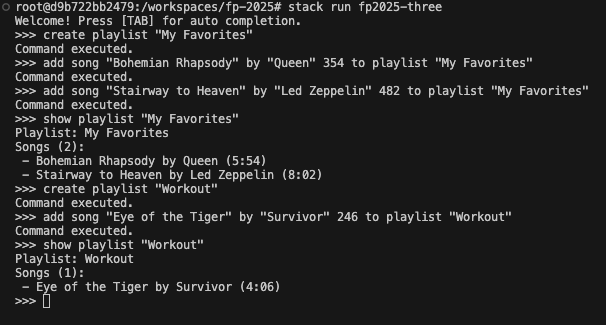
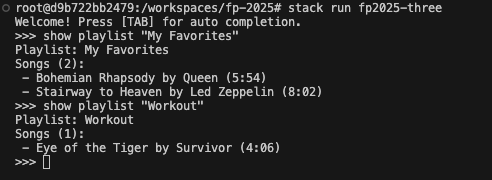
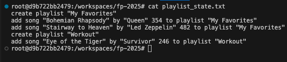

# fp-2025

## Lesson notes

Can be viewed [here](https://vipo.github.io/fp-2025/)

## Setup

### To get started, you first need to open the project using Visual Studio Code and having Docker Desktop
1. `Ctrl + Shift + P`
2. `Dev Containers: Open Folder in Container`

### To Build & Test the Project, run the following commands
1. `stack build`
2. `stack test`

### BNF
```
<Command> ::= "dump" <dumpable>
            | "create playlist" <playlistName>
            | "add song" <song> "to playlist" <playlistName>
            | "add playlist" <playlistName> "to playlist" <playlistName>
            | "show playlist" <playlistName>
            | "total duration of playlist" <playlistName>
            | "play playlist" <playlistName>

<playlistName> ::= <string>

<song> ::= <title> "by" <artist> <duration>
<playlist> ::= <song> | <song> <playlist>

<title> ::= <string>
<artist> ::= <string>
<duration> ::= <Integer>

<Integer> ::= [0-9]
<string> ::= "a"
<dumpable> ::= "examples"
```
## Lab 3: State Persistence

### Command Mapping Details

| Command | Persisted? | Reason |
|---------|-----------|---------|
| `create playlist "<name>"` | Yes | Creates a new playlist |
| `add song "<title>" by "<artist>" <duration> to playlist "<name>"` | Yes | Adds song to playlist |
| `add playlist "<nested>" to playlist "<parent>"` | Yes | Creates playlist nesting relationship |
| `show playlist "<name>"` | No | Query command, doesn't modify state |
| `total duration of playlist "<name>"` | No | Query command, doesn't modify state |
| `play playlist "<name>"` | No | Query command, doesn't modify state |
| `dump examples` | No | Meta command, doesn't modify state |

### State Serialization Strategy

The state is serialized efficiently by:
1. Creating each playlist once
2. Adding all songs to their respective playlists
3. Establishing nested playlist relationships

**Note:** Only modification commands are persisted. Query commands (`show`, `total duration`, `play`) don't affect state and aren't saved.

### Example 1: Simple Playlist with Songs

**Initial State:**
```
Playlist "Favorites":
  - "Yesterday" by "The Beatles" (125s)
  - "Hey Jude" by "The Beatles" (431s)
```

**Generated Commands (playlist_state.txt):**
```
create playlist "Favorites"
add song "Yesterday" by "The Beatles" 125 to playlist "Favorites"
add song "Hey Jude" by "The Beatles" 431 to playlist "Favorites"
```

**Explanation:**
- One `create playlist` command establishes the playlist
- Each song is added with a separate `add song` command
- The order of songs is preserved

## Lib3.hs

---

## State Persistence

### Overview

This application maintains persistent state across sessions by saving the current playlist state to a file (`playlist_state.txt`) and loading it on startup. The state is represented as a sequence of CLI commands that can recreate the exact state when executed.

## Command Mapping Details

| Command | Persisted? | Reason |
|---------|-----------|---------|
| `create playlist "<name>"` | Yes | Creates a new playlist |
| `add song "<title>" by "<artist>" <duration> to playlist "<name>"` | Yes | Adds a song to a playlist |
| `add playlist "<nested>" to playlist "<parent>"` | Yes | Links nested playlists |
| `show playlist "<name>"` | No | Query command, doesn't modify state |
| `total duration of playlist "<name>"` | No | Query command, doesn't modify state |
| `play playlist "<name>"` | No | Query command, doesn't modify state |
| `dump examples` | No | Meta command, doesn't modify state |

## Examples

### Example 1: Simple Playlist with Songs

**Initial State:**
```
Playlist "My Favorites":
  - "Bohemian Rhapsody" by "Queen" (354s)
  - "Stairway to Heaven" by "Led Zeppelin" (482s)
```

**Generated Commands (playlist_state.txt):**
```
create playlist "My Favorites"
add song "Bohemian Rhapsody" by "Queen" 354 to playlist "My Favorites"
add song "Stairway to Heaven" by "Led Zeppelin" 482 to playlist "My Favorites"
```

**Explanation:**
- Start with `create playlist` to create the playlist container
- Add each song in order with all its metadata (title, artist, duration)
- This preserves both the songs and their order in the playlist

### Example 2: Nested Playlists

**Initial State:**
```
Playlist "Rock":
  - Songs: ["Bohemian Rhapsody" by "Queen" (354s)]
  - Nested: ["Classics"]
Playlist "Classics":
  - Songs: ["Imagine" by "John Lennon" (183s)]
```

**Generated Commands (playlist_state.txt):**
```
create playlist "Classics"
add song "Imagine" by "John Lennon" 183 to playlist "Classics"
create playlist "Rock"
add song "Bohemian Rhapsody" by "Queen" 354 to playlist "Rock"
add playlist "Classics" to playlist "Rock"
```

**Explanation:**
- Nested playlists are created first
- Parent playlists are created after their dependencies
- `add playlist` commands establish the nesting relationships
- All songs and relationships are preserved

### Example 3: Multiple Playlists

**Initial State:**
```
Playlist "Workout":
  - "Eye of the Tiger" by "Survivor" (246s)
  - "Thunderstruck" by "AC/DC" (292s)
Playlist "Chill":
  - "Weightless" by "Marconi Union" (480s)
```

**Generated Commands (playlist_state.txt):**
```
create playlist "Workout"
add song "Eye of the Tiger" by "Survivor" 246 to playlist "Workout"
add song "Thunderstruck" by "AC/DC" 292 to playlist "Workout"
create playlist "Chill"
add song "Weightless" by "Marconi Union" 480 to playlist "Chill"
```

**Explanation:**
- Each playlist is independent
- Commands are grouped by playlist for clarity
- State can be partially restored even if some commands fail

## Demonstration Screenshots

### Session 1: Creating Playlists and Adding Songs


*Created playlists, added songs, and displayed the playlists*

### Session 2: State Persisted After Restart


*Restarted the program - all playlists and songs are preserved!*

### Saved State File


*The playlist_state.txt file contains commands that recreate the exact state*